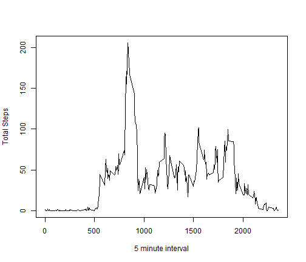

Title:  Peer Assessment 1, Reproducible Research 
=======================================================
Date:  10/06/2014
=======================================================
Author:  J. Gossett
I load packages, set working directory, and read in data file.  I read in the csv file with the read.csv() function.
I convert date to a date object.  


```r
#install.packages("knitr")
library(knitr)
library(plyr)
library(ggplot2)
library(lattice)

setwd("C:/Users/jeff/Desktop/reproducible1")

ds <- read.csv("activity.csv", stringsAsFactors =FALSE)
# convert text date to date.
ds$date <- as.Date(ds$date, format="%Y-%m-%d")
str(ds)
```

```
## 'data.frame':	17568 obs. of  3 variables:
##  $ steps   : int  NA NA NA NA NA NA NA NA NA NA ...
##  $ date    : Date, format: "2012-10-01" "2012-10-01" ...
##  $ interval: int  0 5 10 15 20 25 30 35 40 45 ...
```

Calculate total number of steps per day using ddply function from plyr package. 
================================================================================


```r
sum.by.day <- ddply(ds, .(date), summarize,  sum1=sum(steps))
head(sum.by.day)
```

```
##         date  sum1
## 1 2012-10-01    NA
## 2 2012-10-02   126
## 3 2012-10-03 11352
## 4 2012-10-04 12116
## 5 2012-10-05 13294
## 6 2012-10-06 15420
```

The data contain measurements at five minute increments for the 61 days/dates; however, 8 days have no data.  


```r
# Numbers in inline R calculations in above:
length(unique(ds$date))
```

```
## [1] 61
```

```r
nrow(sum.by.day[is.na(sum.by.day$sum1),])
```

```
## [1] 8
```


Make a histogram of the total number of steps taken each day 
====================================================================
I use the ggplot package to make a histogram.  I chose a binwidth of 1000.


```r
m <- ggplot(sum.by.day, aes(x=sum1))
m + geom_histogram(origin=0, binwidth=1000, fill='gray', color='black') + ylab("Count (days)") + xlab("Total steps per day")+ 
      theme_bw() +  scale_y_continuous(breaks=seq(0,10,2))
```

 

```r
ggsave(filename="histogram1.png", width=6, height=4, units="in", dpi=300)
```

 


Calculate and report the mean and median total number of steps taken per day
================================================================================

The mean number of steps per day was 10766.
The median number of steps per day was 10765.


```r
# Mean number of steps per day
prettyNum(mean(sum.by.day$sum1, na.rm=T))
```

```
## [1] "10766"
```

```r
# Median number of steps per day:
prettyNum(median(sum.by.day$sum1, na.rm=T))
```

```
## [1] "10765"
```


 What is the average daily activity pattern?  Make a time series plot (i.e. type = "l") of the 5-minute 
 interval (x-axis) and the average number of steps taken, averaged across all days (y-axis).  I use the
 ddply function from plyr package to calculate mean1, a vector of the average number of steps for each 
 5 minute interval.  Then I use the head function to display the first 6 rows of the sum.by.interval object.


```r
sum.by.interval <- ddply(ds, .(interval), summarize, mean1=mean(steps, na.rm=TRUE))
head(sum.by.interval$mean1)
```

```
## [1] 1.71698 0.33962 0.13208 0.15094 0.07547 2.09434
```
Using the base plotting system, I created a time series line plot of mean steps.  

```r
plot(mean1 ~ interval, data=sum.by.interval, type="l", ylab="Total Steps", xlab="5 minute interval")
```

 

Which 5-minute interval, on average across all the days in the dataset, contains the maximum number of steps?
===============================================================================================================

The interval with the max mean was 835, and the mean max number of 
steps was 206.1698.


 

```r
# First find the interval with the which.max() function:
sum.by.interval$interval[which.max(sum.by.interval$mean1)]
```

```
## [1] 835
```

```r
# Check the mean for that interval
sum.by.interval$mean1[which.max(sum.by.interval$mean1)]
```

```
## [1] 206.2
```
Using the abline function, I replot the time series plot and display a red line at the time interval containing the 
maximum number of steps. 


```r
plot(mean1 ~ interval, data=sum.by.interval, type="l", ylab="Total Steps", xlab="5 minute interval")
abline(v=sum.by.interval$interval[which.max(sum.by.interval$mean1)], col="red", lty=3, lwd=1)
```

 

 Imputing missing values
======================================================================================================== 
 Note that there are a number of days/intervals where there are missing values (coded as NA). 
 The presence of missing days may introduce bias into some calculations or summaries of the data.
 Calculate and report the total number of missing values in the dataset (i.e. the total number of rows with NAs)


The total number of rows with NAs was  2304.


```r
nrow(ds[!complete.cases(ds),])
```

```
## [1] 2304
```

```r
#alternatively:
      nrow(ds[is.na(ds$steps),])
```

```
## [1] 2304
```


Devise a strategy for filling in all of the missing values in the dataset. 
=================================================================================
 **** Strategy.  
1  Calculate median steps per 5 minute interval using the ddply function from the plyr package.
2  Merge median values back to original data by interval
3  If steps value is missing (i.e. NA), replace steps with median1.
4  Use complete/imputed data set for calculations and plots.


```r
s1 <- ddply(ds, .(interval), summarize, median1=median(steps, na.rm=TRUE))

dsi <- merge(ds, s1, by="interval", all.x=TRUE)

dsi$steps[is.na(dsi$steps)] <- dsi$median1[is.na(dsi$steps)]
```

Calculate and report the mean and median total number of steps taken per day. Do these values differ from the 
estimates from the first part of the assignment? What is the impact of imputing missing.


```r
 # calculate total number of steps per day using imputed data
sum.by.day2 <- ddply(dsi, .(date), summarize, sum1=sum(steps))

length(unique(dsi$date))
```

```
## [1] 61
```

How does the mean and median of total steps per day change after imputation.

1 The mean number of steps per day prior to imputation was:  1.0766 &times; 10<sup>4</sup>.
2 The mean number of steps per day after imputation was:  9503.8689.
3 The median number of steps per day prior to imputation was:  10765.
4 The median number of steps per day after imputation was:  10395.

Both the mean and median number of steps dropped after imputation.  


```r
##1 The mean number of steps per day prior to imputation was:  
mean(sum.by.day$sum1, na.rm=TRUE)
```

```
## [1] 10766
```

```r
##2 The mean number of steps per day after imputation was:  
mean(sum.by.day2$sum1, na.rm=TRUE)
```

```
## [1] 9504
```

```r
##3 The median number of steps per day prior to imputation was:  
median(sum.by.day$sum1, na.rm=TRUE)
```

```
## [1] 10765
```

```r
##4 The median number of steps per day after imputation was:  
median(sum.by.day2$sum1, na.rm=TRUE)
```

```
## [1] 10395
```


Make a histogram of the total number of steps taken each day.
============================================================== 
Using the ggplot, a histogram of steps per day after imputation is displayed.  Each bin represents 1000 steps (i.e. binwidth=1000.)

```r
m <- ggplot(sum.by.day2, aes(x=sum1))
m + geom_histogram(origin=0, binwidth=1000, fill='gray', color='black') + ylab("Count (days)") + xlab("Total steps per day")+ 
      theme_bw() +  scale_y_continuous(breaks=seq(0,10,2)) + 
      ggtitle("Missing steps imputed") +
           theme(plot.title = element_text(lineheight=.6, face="bold", size=18)) +
      theme(axis.title.x = element_text(face="bold", size=20),
            axis.text.x  = element_text(face="bold", angle=0, vjust=0.5, size=14),
            axis.title.y = element_text(face="bold", size=20),
            axis.text.y  = element_text(face="bold", angle=0, vjust=0.5, size=14))
```

 

```r
ggsave(filename="histogram2_imputedNAs.png", width=6, height=4, units="in", dpi=300)
```

 

```r
# Good references
# ref for title:  http://www.cookbook-r.com/Graphs/Titles_(ggplot2)/ 
# ref for axis titles:  http://www.cookbook-r.com/Graphs/Axes_(ggplot2)/ 
```
 

 Are there differences in activity patterns between weekdays and weekends?
============================================================================== 
* For this part the weekdays() function may be of some help here. 
* Use the dataset with the  filled-in missing values for this part.
* Create a new factor variable in the dataset with two levels – “weekday” and “weekend” indicating whether a given date is a weekday or weekend day.
* Calculate average number of steps per five minute interval using the imputed data, separately by weekend/weeday.  


```r
dsi$dayofweek <- weekdays(dsi$date)
str(dsi$dayofweek)
```

```
##  chr [1:17568] "Monday" "Friday" "Sunday" "Tuesday" ...
```

```r
dsi$weekday <- 1
dsi$weekday[dsi$dayofweek %in% c("Saturday", "Sunday")] <- 2
dsi$daytype <- factor(dsi$weekday, levels=c(1,2), labels=c("Weekday", "Weekend"))
  #  with(dsi, table(dayofweek, weekday, useNA="ifany"))

# use ddply function from plyr package to calculate mean number of steps by interval and daytype (weekend/weekday)
sum.by.int.daytype <- ddply(dsi, .(interval, daytype), summarize, mean1=mean(steps, na.rm=TRUE))
#summary(sum.by.int.daytype$mean1)
```


* Make a panel plot containing a time series plot (i.e. type = "l") of the 5-minute interval 
(x-axis) and the average number of steps taken, averaged across all weekday days or weekend days (y-axis). 


```r
library(lattice)

xyplot(mean1 ~ interval | daytype, data=sum.by.int.daytype, type="l", ylab="Total Steps", xlab="5 minute interval",
       layout=c(1,2))
```

 
